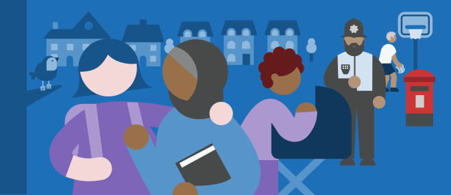
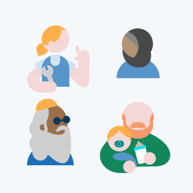
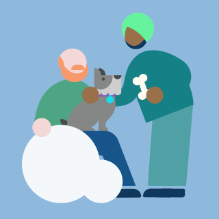
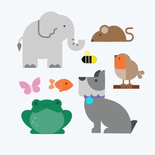

Our character style uses abstract realism, combining simplified forms with realistic proportions. Storytelling is grounded in real-world situations, using anatomy that respects the natural human and animal structure.


Composite illustration of human characters, front view with props/items.




## Human design

Our geometric character system is built from three core shapes: circles for heads and hands, rounded rectangles for bodies, and curved paths for limbs. To ensure a lightweight feel and realism for human characters maintain a consistent gap between the head and torso. In some cases, facial hair may overlap this gap, which is acceptable.

## Representation

We use a colour palette that includes a variety of different skin tones. Be sure to represent a diverse range of people in your illustrations, bringing individuality to characters through:

- age
- hairstyle or headwear
- clothing and religious dress
- varying body sizes and shapes
- showing disabilities


Avoid relying on clichés or reinforcing misconceptions.


## Facial features

We deliberately refrain from depicting eyes or other facial features. This ensures that the focus remains on body language, mood and the overall atmosphere of the scene, rather than on a characters particular traits or expressions.


One concession to detailing on the face is the inclusion of spectacles.


## Creating arms

Arms are drawn with the path tool using Bézier curves to create the desired shape, with a circle for the hand. Vary stroke width to match the body type, and ensure the hand diameter matches the arm width exactly.

## Body language and interaction

Storytelling can be hinted at through interactions between characters. Even with simple forms, subtle gestures and overlaps can effectively communicate narrative and human connections within the scene.

## Animals

When drawing animals, start with basic geometry. Avoid strokes unless they are essential for the readability of the shape, for e.g. the stroke on the elephants ear. For larger animals, use rounded eyes to ensure they feel 'alive'.


