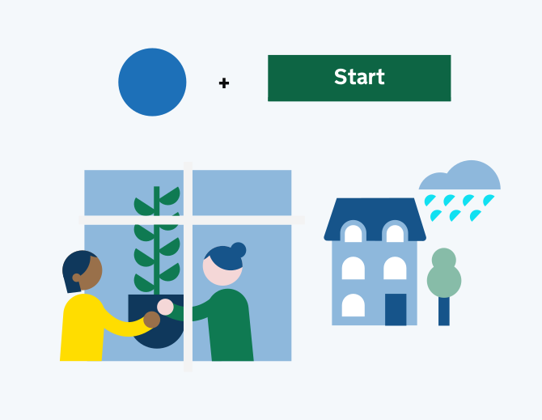

## Why use illustrations?

### Enhances clarity and accessibility

Illustrations are especially useful when communicating abstract or complex concepts that words alone may not sufficiently convey. Our illustrations are thoughtful and inclusive, taking into account the diversity and needs of people who rely on GOV.UK products and services. They can also help communicate information to people who may have difficulty reading text or whose first language is not English. This supports user understanding, making government communications and content feel clearer, more accessible, and relevant for everyone.

### Builds trust and consistency

The GOV.UK illustration style is part of a reusable, unified, and consistent brand system that delivers a recognisable visual language. This enables users to quickly identify official government touch-points and channels, which reinforces GOV.UK brand recognition, saving users time and building trust at scale across products and services.

### Improves team efficiency

For teams, a reusable, unified and clear visual system as part of the brand system reduces image fragmentation and duplication, contributing to faster implementation and delivery while maintaining quality.

## About our illustrations

This section outlines the GOV.UK illustration style, it provides insight into where and how they can be used as well as providing step-by-step guidance on how to create illustrations.

Our illustration style utilises solid, unshaded colour and a minimalist aesthetic, clean lines and geometric shapes inspired by ‘the dot’ in GOV.UK. The ‘dot’, and sections of a circle, are key building blocks of our illustration style, appearing in the faces and hands of our characters, speech bubbles, buttons, plants, trees, and the sun in the sky.

Our illustrations are used to enhance engagement with content and the GOV.UK brand. Alongside appropriate copy, imagery can be used to clarify complex information, aid comprehension and bring a stronger sense of storytelling to our communications.

In our illustrations we look to find balance between the roundness of the circle derived from the dot, in contrast to the squareness of the buttons of the GOV.UK Design System.

## Illustrations or icons?

Illustrations and icons serve distinct roles within our brand. Our illustrations are multi-layered, expressive and detailed. Often used to tell stories, add personality, or to inspire a more emotive response from the viewer.

Icons are simpler, more functional and are generally used at a smaller scale.

## Illustration examples

Illustrations can be used across GOV.UK channels. These images show how they might appear in app, social posts or web.

Pairing illustrations with simple typography helps them stand out and supports messaging without adding visual clutter. It keeps layouts clear and focused. Illustrations can be simple or more complex depending on the message needed or where they will be seen.

**(TODO: how should multi-image SVGS be embedded?)**
